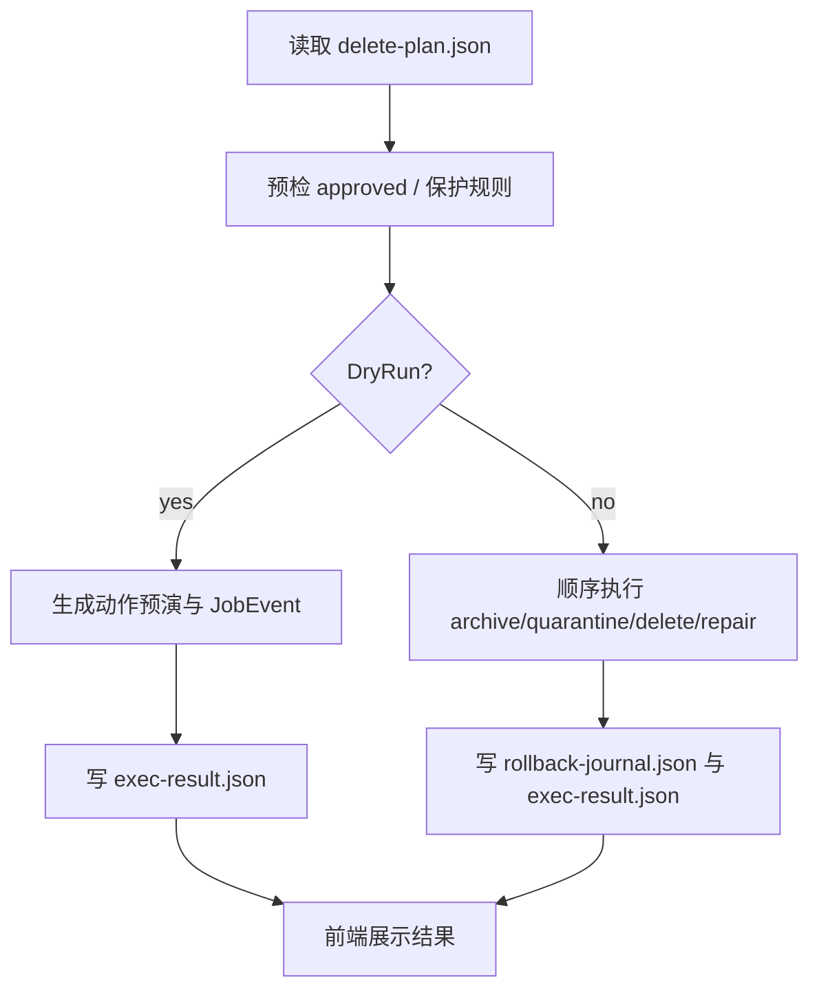

# archive-and-quarantine-execution feature design

## 0. 术语约定

- **删除计划**：沿用 `CONTEXT.md`，指 destructive 动作前的结构化清单；防冲突结论：本 feature 只消费 approved plan，不生产 plan。
- **隔离区**：沿用 `CONTEXT.md`，指待永久清理前的本地暂存位置；防冲突结论：不是归档目录。
- **回滚日志**：沿用 `CONTEXT.md`，指 destructive 前后路径映射和结果记录；防冲突结论：不是普通调试日志。

## 1. 决策与约束

### 1.1 需求摘要

要做的是：消费已确认的 `delete-plan.json`，在 Go 后端按步骤执行 archive / quarantine / delete / repair_index，并把进度、结果和 rollback journal 持续回传到桌面工作区。

成功标准：

- dry-run 能完整展示将执行的动作，但不改动源文件。
- confirmed run 能执行样本动作并写 `rollback-journal.json` / `exec-result.json`。
- 保护中的活动数据库或敏感文件会被显式阻断，而不是半执行后失败。

明确不做：

- 不在本 feature 完成在线备份与执行后复扫闭环。
- 不允许未批准计划直接进入 destructive 动作。
- 不允许前端直接调用文件系统删除。

### 1.2 复杂度档位

走 Windows 单机桌面工具默认档位，无偏离。

### 1.3 关键决策

- destructive 流程仍由 Go 后端顺序执行；前端只提供确认与观察。
- dry-run 与 confirmed run 共用同一编排骨架，只在动作执行器上分叉，避免两套逻辑漂移。
- `JobEvent` 是桌面进度面的唯一权威输入，不靠打印日志猜状态。

### 1.4 基线风险

- item3 尚未落地前没有真实 approved plan。
- 如果执行前保护规则不够硬，后续验证层会接手一个已被污染的运行结果。

### 1.5 执行风险与证据计划

- Top 3 风险：
  - approved=false 仍被执行。缓解：预检 gate 在进入动作编排前就阻断。
  - 活动 SQLite / 受保护文件被半途中删除。缓解：执行前先做保护检查。
  - 进度面靠日志猜状态。缓解：所有阶段都走 `JobEvent`。
- 非显然依赖：
  - item3 已稳定生成 approved plan。
  - 需要可重复运行的样本隔离区和 fixture plan。
- 证据类型：
  - `rollback-journal.json`、`exec-result.json`
  - progress 工作区截图
  - 执行层测试输出
- 关键假设：
  - 桌面确认动作会把 plan 状态切到“可执行”，但不会修改动作内容。
- 交付物清单：
  - 执行编排器
  - progress event emitter
  - rollback / result writer
  - 确认对话与执行面板
- 清洁度规则：
  - 禁止用 `print` / `console.log` 代替 `JobEvent`。
  - 禁止“失败后继续删剩余项再说”的吞错策略。

## 2. 名词与编排

### 2.1 名词层

**现状**：

- 代码层暂无执行器；唯一硬约束来自 roadmap 4.4 `Delete Plan`、4.5 `JobEvent` 和 4.6 rollback artifacts。
- 当前仓库尚无 approved plan 或隔离区结构。

**变化**：

- 新增 `ExecutionRequest`：包含 plan 路径、dry-run 标志和操作者确认上下文。
- 新增 `ActionReceipt`：保存每一步动作结果、错误和对应 artifact。
- 新增 `ProgressSnapshot`：前端按 `run_id` 汇总阶段进度与当前项。

**接口示例**：

```go
result, err := ExecutePlan(ExecutionRequest{
  PlanPath: "tmp\\runs\\20260630-103000\\delete-plan.json",
  Confirmed: true,
  DryRun: false,
})
// 正常：返回 exec-result 和 rollback-journal 路径
// 错误：approved=false、保护规则命中或动作失败时显式返回 error / JobEvent
// 来源：roadmap 4.4 / 4.5 / 4.6
```

### 2.2 编排层



**现状**：

- 当前没有执行编排、确认流、进度面或 rollback writer。

**变化**：

- 后端先做 approved / 保护规则预检，再进入 dry-run 或 confirmed run。
- confirmed run 按计划顺序执行动作，失败立即暴露并停止继续 destructive 分支。
- 前端通过 `JobEvent` 展示当前阶段、当前项和 artifact 路径。

**流程级约束**：

- `approved=false` 时只能 dry-run。
- 受保护文件命中即阻断 destructive 分支。
- confirmed run 任一 destructive 动作成功后，必须落一条 rollback 记录。

### 2.3 挂载点清单

- `internal/execution` 或等价执行服务入口 — 新增
- `frontend/src/screens/execution` 或等价执行面板 — 新增
- 执行确认对话入口 — 新增
- `rollback-journal.json` / `exec-result.json` writer — 新增

### 2.4 推进策略

1. 编排骨架：建立执行入口、dry-run 分支和结果占位  
   退出信号：能消费 plan 并返回结构完整的 dry-run 预演结果
2. 保护节点：实现 approved gate 和敏感文件预检  
   退出信号：未批准计划和受保护对象都会被显式阻断
3. 动作节点：实现 archive / quarantine / delete / repair 执行器  
   退出信号：样本 plan 能按顺序执行并在失败时立即暴露
4. 证据节点：写 rollback / result artifact，并回传 `JobEvent`  
   退出信号：工作区能看到阶段进度和 artifact 路径
5. 验证收尾：补齐执行样本、测试和构建命令  
   退出信号：dry-run、confirmed run 和保护规则都有证据

### 2.5 结构健康度与微重构

##### 评估

- 文件级：暂无现有源码文件可改，预期在后端新增 execution 子包，在前端新增执行面板。
- 目录级 — `internal/execution/`、`frontend/src/screens/`：目录会新增，但职责清晰，不存在摊平问题。

##### 结论：不做

当前阶段需要的是独立 execution 子包和执行面板，不需要前置微重构。

## 3. 验收契约

### 3.1 关键场景清单

- approved=false 的计划 → 只能 dry-run，不能执行 destructive 动作
- dry-run → 生成完整预演与进度，但源文件无变化
- confirmed run 样本计划 → 生成 rollback / result artifact，并在工作区看到阶段进度
- 受保护文件或活动数据库 → 在 destructive 前被阻断并显式报错

### 3.2 明确不做的反向核对项

- 代码中不应存在前端直接删文件的逻辑。
- 本 feature 结果中不应承诺已经做完在线备份与执行后复扫闭环。

### 3.3 Acceptance Coverage Matrix

| Scenario | Covered By Step | Evidence Type | Command / Action | Core? |
|---|---|---|---|---|
| 未批准计划只能 dry-run | S2 | test, json artifact | 执行未批准 plan 样本 | yes |
| dry-run 不改动源文件 | S1 / S4 | test, diff review | 比对运行前后 fixture | yes |
| confirmed run 生成 rollback / result | S3 / S4 | json artifact, screenshot | 执行样本 plan | yes |
| 受保护对象被阻断 | S2 / S5 | test, screenshot | 执行命中保护规则的 plan | yes |

### 3.4 DoD Contract

| ID | 要求 | 证据 | 阻塞级别 |
|---|---|---|---|
| DOD-DESIGN-001 | approved gate、保护规则和 progress 语义可执行 | design review | blocking |
| DOD-IMPL-001 | 执行器、JobEvent 和 rollback/result artifact 落盘 | checklist / evidence | blocking |
| DOD-REVIEW-001 | code review passed 且无 unresolved blocking | review report | blocking |
| DOD-QA-001 | QA 覆盖 dry-run、confirmed run 和保护规则 | QA report | blocking |
| DOD-ACCEPT-001 | acceptance 确认前端无越权 destructive 调用 | acceptance report | blocking |

Validation Commands:

| ID | 命令 | 目的 | 核心性 | 失败处理 |
|---|---|---|---|---|
| CMD-001 | `go test ./internal/...` | 验证执行器、保护规则和 artifact writer | core | fix-or-block |
| CMD-002 | `npm --prefix frontend run build` | 验证执行面板可构建 | supporting | fix-or-block |
| CMD-003 | `wails build -clean` | 验证桌面集成未破坏打包 | supporting | fix-or-block |

Required Artifacts: `rollback-journal.json`、`exec-result.json`、执行面板截图、review / QA / acceptance 报告。

## 4. 与项目级架构文档的关系

- `隔离区`、`回滚日志` 已在 `CONTEXT.md` 定义，本 feature 把它们落成可执行 artifact。
- destructive 前必须检查计划审批与保护规则，这属于稳定流程级约束；acceptance 时要评估是否回写长期 guide 或 ADR。
- `JobEvent` 语义必须严格遵守 roadmap 4.5，不能在实现时改成非结构化日志。
