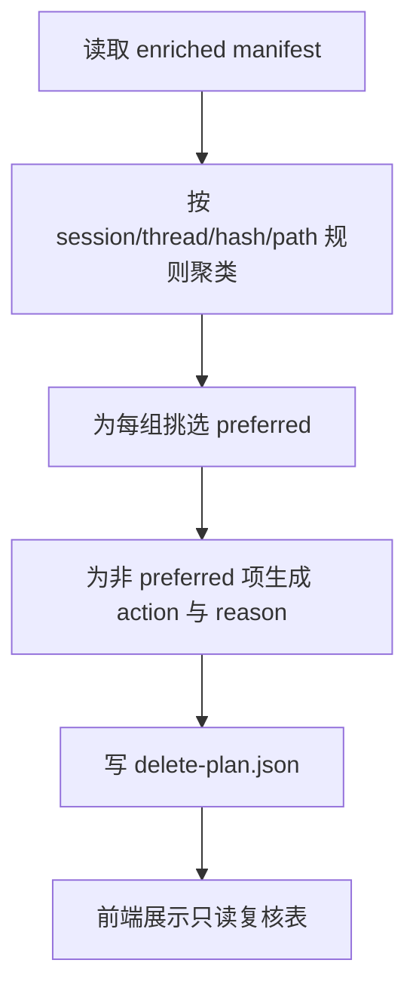

# duplicate-grouping-and-retention-planning feature design

## 0. 术语约定

- **逻辑重复**：沿用 `CONTEXT.md`，指同一会话内容的多入口记录；防冲突结论：不等同于物理重复。
- **保留本**：沿用 `CONTEXT.md`，指重复组里被选为权威保留对象的一份；防冲突结论：不等于“最新文件”。
- **删除计划**：沿用 `CONTEXT.md`，指 destructive 动作前的结构化清单；防冲突结论：本 feature 只生成计划，不执行计划。

## 1. 决策与约束

### 1.1 需求摘要

要做的是：消费归一化后的 manifest，生成稳定的 `duplicate_group`、唯一 `preferred=true` 的保留本、可解释的 `reason`，并把结果投影成桌面可复核的 `delete-plan.json`。

成功标准：

- 同一逻辑会话进入同一 `duplicate_group`。
- 每个重复组最多一条保留本，且原因可审阅。
- `delete-plan.json` 初始始终 `approved=false`，桌面工作区可复核每项动作。

明确不做：

- 不执行 archive / quarantine / delete。
- 不跳过人工确认自动把 `approved` 改成 true。
- 不把浏览器旁路对象纳入默认删除动作。

### 1.2 复杂度档位

走 Windows 单机桌面工具默认档位，无偏离。

### 1.3 关键决策

- 分组与保留本选择分两段完成：先聚类，再选 preferred，避免把规则揉成黑盒。
- `reason` 必须是结构化、可展示、可复核的解释，不允许只写“best candidate”。
- 前端只负责筛选和查看计划，不允许修改 delete plan 真值。

### 1.4 基线风险

- item1 / item2 尚未落地前，当前仓库没有真实 enriched manifest。
- 保留本策略如果写得太宽松，后续执行层会被迫消费不可信计划。

### 1.5 执行风险与证据计划

- Top 3 风险：
  - 分组规则误把物理重复和逻辑重复混为一谈。缓解：输入只消费 item2 的归一化事实。
  - 同组出现多个 preferred。缓解：在 writer 前加唯一性校验。
  - 桌面工作区允许用户直接改计划。缓解：前端只读，后端生成 artifact 才是权威。
- 非显然依赖：
  - item2 已稳定输出 `canonical_path`、`real_path` 和 warning。
  - 需要至少一组逻辑重复样本和一组物理重复样本夹具。
- 证据类型：
  - `delete-plan.json`
  - 重复组 diff / 工作区截图
  - 规划层测试输出
- 关键假设：
  - 保留本默认策略以路径事实、更新时间、CLI 可见性和内容证据共同决定，而不是单指标。
- 交付物清单：
  - 分组服务
  - 保留本选择规则
  - delete plan writer
  - 桌面复核工作区
- 清洁度规则：
  - 禁止在前端缓存“可编辑计划”作为真实来源。
  - 禁止用 magic number 或隐式优先级排序替代显式 reason code。

## 2. 名词与编排

### 2.1 名词层

**现状**：

- 代码层暂无实现；roadmap 4.4 `Delete Plan` 是唯一硬约束。
- item2 预期提供 enriched manifest，但当前仓库尚无真实样本。

**变化**：

- 新增 `DuplicateGroup`：承载同组候选、group id 和摘要信息。
- 新增 `RetentionDecision`：保存 preferred 选择结果、reason code、confidence 和 warning。
- 新增 `PlanPreviewRow`：桌面工作区用的只读投影视图，不反向写回策略真值。

**接口示例**：

```go
plan := BuildDeletePlan(enrichedManifest)
// 正常：同组只有一条 preferred=true，approved=false
// 边界：若无法决策，计划项进入 warning / review-needed，而不是默认 delete
// 来源：roadmap 4.4 Delete Plan
```

### 2.2 编排层



**现状**：

- 当前没有重复组服务、保留本规则或计划复核工作区。

**变化**：

- 后端按稳定输入先聚类，再挑选 preferred，再生成计划。
- 决策不充分的组进入 `review-needed` / warning，而不是继续流向 destructive 动作。
- 前端展示组内候选、preferred、reason 和建议动作，但不修改 artifact 真值。

**流程级约束**：

- 每个 `duplicate_group` 最多一条 `preferred=true`。
- `approved` 初始固定为 `false`。
- 任何默认动作都必须附可审阅 `reason`。

### 2.3 挂载点清单

- `internal/planning` 或等价服务入口：注册分组与计划生成 — 新增
- `frontend/src/screens/plan-review` 或等价复核页面 — 新增
- `delete-plan.json` writer — 新增
- `fixtures/duplicates` 或等价样本目录 — 新增

### 2.4 推进策略

1. 编排骨架：建立分组服务入口和空 delete plan 投影  
   退出信号：能消费 enriched manifest 并返回结构完整的空计划
2. 计算节点 A：实现重复组聚类规则  
   退出信号：样本能稳定生成 `duplicate_group`
3. 计算节点 B：实现保留本选择和 reason code  
   退出信号：每组最多一条 preferred，原因可解释
4. 写入与展示：生成 `delete-plan.json` 并接通复核工作区  
   退出信号：前端能只读查看计划项与 reason
5. 验证收尾：补齐逻辑/物理重复样本与构建命令  
   退出信号：测试、artifact 和工作区截图都能落盘

### 2.5 结构健康度与微重构

##### 评估

- 文件级：暂无现有源码文件可改，预期在 item1 / item2 建好的后端目录下新增 planning 子包。
- 目录级 — `internal/planning/`、`frontend/src/screens/`：目录会新增，但职责边界清晰，不存在摊平信号。

##### 结论：不做

当前阶段新增的是独立 planning 子包和复核页面，不需要前置微重构。

## 3. 验收契约

### 3.1 关键场景清单

- 同一逻辑会话的多入口记录 → 进入同一 `duplicate_group`
- 每组恰好一条 preferred → 其余项有明确 `action` 与 `reason`
- 证据不足的组 → 进入 warning / review-needed，不默认 delete
- 前端复核界面 → 能查看组内候选与计划项，但不能改 artifact 真值

### 3.2 明确不做的反向核对项

- `delete-plan.json` 中不应出现 `approved=true` 初始状态。
- 前端代码中不应出现直接写 delete plan artifact 的逻辑。

### 3.3 Acceptance Coverage Matrix

| Scenario | Covered By Step | Evidence Type | Command / Action | Core? |
|---|---|---|---|---|
| 同组聚类稳定 | S2 | test, json artifact | 运行规划层测试 | yes |
| 每组仅一条 preferred | S3 | test, diff review | 检查计划与重复组输出 | yes |
| 不确定组进入 review-needed | S3 / S4 | json artifact, screenshot | 导入模糊样本并查看工作区 | yes |
| 前端只读复核 | S4 | screenshot | 进入计划复核界面 | no |

### 3.4 DoD Contract

| ID | 要求 | 证据 | 阻塞级别 |
|---|---|---|---|
| DOD-DESIGN-001 | 分组、保留本和只读复核边界可执行 | design review | blocking |
| DOD-IMPL-001 | `delete-plan.json`、重复组与 reason code 落盘 | checklist / evidence | blocking |
| DOD-REVIEW-001 | code review passed 且无 unresolved blocking | review report | blocking |
| DOD-QA-001 | QA 覆盖确定组与不确定组 | QA report | blocking |
| DOD-ACCEPT-001 | acceptance 确认计划仍需人工确认且前端未越权 | acceptance report | blocking |

Validation Commands:

| ID | 命令 | 目的 | 核心性 | 失败处理 |
|---|---|---|---|---|
| CMD-001 | `go test ./internal/...` | 验证分组、preferred 和 plan writer | core | fix-or-block |
| CMD-002 | `npm --prefix frontend run build` | 验证计划复核界面可构建 | supporting | fix-or-block |
| CMD-003 | `wails build -clean` | 验证桌面集成未破坏构建 | supporting | fix-or-block |

Required Artifacts: `delete-plan.json`、重复组样本输出、计划复核截图、review / QA / acceptance 报告。

## 4. 与项目级架构文档的关系

- `保留本`、`删除计划` 已在 `CONTEXT.md` 定义，本 feature 只把定义落成可执行 artifact。
- 如果 preferred 选择规则沉淀成长期结构性约束，acceptance 时再评估是否补 ADR；design 阶段先不新增。
- 计划产物必须严格遵守 roadmap 4.4，不允许在实现时私自新增 destructive 默认值。
