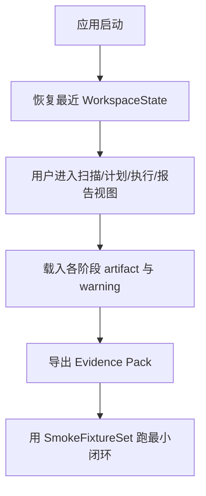

# operator-surface-and-fixtures feature design

## 0. 术语约定

- **桌面壳层**：沿用 `CONTEXT.md`，指 Wails2 宿主与前端工作区；防冲突结论：不是单独某一页。
- **执行任务**：沿用 `CONTEXT.md`，指一次扫描 / 计划 / 执行作业；防冲突结论：工作区可以切换任务，但不伪造任务结果。
- **Evidence Pack**：本 feature 导出的证据集合，包含关键 artifact 路径、截图索引和阶段报告清单；防冲突结论：不是新的真源。

## 1. 决策与约束

### 1.1 需求摘要

要做的是：把前 5 条 feature 的后台能力收口成一个可持续操作的桌面工作区，补齐空态 / 错误态 / 长路径 / 证据导出 / fixture smoke 流程和最终 build 验证，让项目从“有能力模块”变成“可被操作者完整走通”。

成功标准：

- 桌面工作区能覆盖扫描、计划、执行、验证和报告查看。
- 样本夹具能驱动一条最小 smoke 路径。
- 能导出 evidence pack，并完成桌面 build 验证。

明确不做：

- 不扩展到云端同步、账号体系或远程协作。
- 不在本 feature 增加新的 destructive 语义。
- 不承诺跨平台打包与分发。

### 1.2 复杂度档位

走 Windows 单机桌面工具默认档位，无偏离。

### 1.3 关键决策

- 工作区以“任务视角”组织，而不是按后端模块零散堆页面。
- fixture smoke 流程是收口 feature 的硬验收，不把“人工脑补能跑通”当证据。
- evidence pack 只导出现有事实，不生成新的解释性真值。

### 1.4 基线风险

- 前 5 条 feature 还未实现，当前没有真实 artifact 链可以串联。
- 如果工作区不先设计为任务视角，后续容易变成多个孤立页面拼盘。

### 1.5 执行风险与证据计划

- Top 3 风险：
  - 工作区状态散落在多个页面，无法恢复。缓解：统一 `WorkspaceState`。
  - smoke 只验证局部页面，不走完整链路。缓解：至少一条 fixture 走扫描→计划→执行预演→报告。
  - evidence pack 重新拼真值。缓解：仅索引现有 artifact 和报告。
- 非显然依赖：
  - 前 5 条 feature 已稳定输出 artifact 和工作区事件。
  - 需要可公开放入仓库的最小 fixture 数据集。
- 证据类型：
  - 工作区截图
  - evidence pack 索引
  - smoke / build 命令输出
- 关键假设：
  - 任务历史只需要本地最近一次或最近若干次，不做复杂任务中心。
- 交付物清单：
  - 统一工作区导航与状态
  - fixture smoke 数据与入口
  - evidence pack 导出
  - build / smoke 验证入口
- 清洁度规则：
  - 禁止留下只为 demo 存在的按钮或隐藏入口。
  - 禁止 evidence pack 复制大文件正文或生成伪摘要。

## 2. 名词与编排

### 2.1 名词层

**现状**：

- 当前代码层没有统一工作区、fixture smoke 流程或 evidence pack。
- 前 5 条 feature 只在 roadmap / design 中定义了各自的 artifact 与状态。

**变化**：

- 新增 `WorkspaceState`：保存当前任务、最近 artifact、当前阶段和可恢复 UI 状态。
- 新增 `SmokeFixtureSet`：定义可重复驱动最小闭环的样本数据集。
- 新增 `EvidencePackIndex`：把 artifact、截图和阶段报告组织成可导出的索引文件。

**接口示例**：

```json
{
  "run_id": "20260630-103000",
  "current_stage": "plan-review",
  "artifacts": {
    "discovery": "tmp\\runs\\...\\discovery.json",
    "plan": "tmp\\runs\\...\\delete-plan.json"
  },
  "warnings": ["cli unavailable"]
}
```

### 2.2 编排层



**现状**：

- 当前没有统一工作区，也没有把各阶段 artifact 汇总成最终操作面。

**变化**：

- 桌面壳层改为任务驱动工作区，统一展示阶段、warning 和 artifact 入口。
- smoke fixture 贯穿扫描→计划→执行预演→报告查看，而不是单页验证。
- evidence pack 导出现有证据索引，供 review / QA / acceptance 使用。

**流程级约束**：

- 工作区恢复只能消费真实 artifact 和状态，不得生成虚构阶段。
- evidence pack 只索引文件与报告，不复制大体积原文数据作为新真源。
- smoke 流程至少覆盖一条最小闭环和一条错误态。

### 2.3 挂载点清单

- `frontend/src/app/workspace` 或等价导航入口 — 新增/重组
- evidence pack 导出动作入口 — 新增
- `fixtures/smoke` 或等价样本目录 — 新增
- build / smoke 命令入口（README 或脚本配置） — 新增

### 2.4 推进策略

1. 编排骨架：建立统一工作区导航和 `WorkspaceState`  
   退出信号：应用能恢复最近任务状态并切换阶段视图
2. 证据整合：接通各阶段 artifact、warning 和报告入口  
   退出信号：工作区能查看扫描、计划、执行、验证四类证据
3. 导出节点：生成 evidence pack 索引与导出动作  
   退出信号：导出后可定位所有关键 artifact 与阶段报告
4. Smoke 节点：建立最小 fixture 数据集和闭环 smoke 流程  
   退出信号：至少一条成功路径和一条错误路径可重放
5. 收尾验证：补齐 build / smoke 命令、空态 / 错误态 / 长路径 UI  
   退出信号：工作区主要状态都有截图或 smoke 证据

### 2.5 结构健康度与微重构

##### 评估

- 文件级：前端工作区可能由前几条 feature 累积出多个页面入口，但当前仓库尚无代码可评估。
- 目录级 — `frontend/src/`、`fixtures/`：本 feature 会把散点页面收口到统一工作区目录，同时新增 smoke 夹具目录；若前端页面在实现中出现摊平，允许做“重组目录”型微重构。

##### 结论：不做

design 阶段先定义统一工作区归属；是否需要真正重组前端目录，等实现看实际页面数量再决定。

##### 超出范围的观察

- 如果前端在前 5 条实现后已经形成跨页面状态散落、组件职责混乱的问题，应另起 `cs-refactor` 做 UI 状态与目录收口，本 feature 不在 design 阶段预设行为性重构。

## 3. 验收契约

### 3.1 关键场景清单

- 应用启动后恢复最近任务 → 可进入扫描、计划、执行、报告视图
- evidence pack 导出 → 能定位 discovery / plan / rollback / after manifest / 阶段报告
- smoke fixture 成功路径 → 走通最小闭环
- smoke fixture 错误路径 → 能看到显式错误态 / warning
- 长路径、空态、错误态 → 在工作区可见而不是布局溢出或静默空白

### 3.2 明确不做的反向核对项

- 代码中不应新增新的 destructive 动作入口。
- evidence pack 中不应复制大型数据正文作为新真源。

### 3.3 Acceptance Coverage Matrix

| Scenario | Covered By Step | Evidence Type | Command / Action | Core? |
|---|---|---|---|---|
| 恢复最近任务并切换阶段视图 | S1 / S2 | screenshot | 启动应用并切换工作区 | yes |
| 导出 evidence pack | S3 | json artifact, screenshot | 触发导出动作 | yes |
| fixture 最小闭环 smoke | S4 | command output, screenshot | 运行 smoke 流程 | yes |
| 错误态 / 长路径 / 空态可见 | S5 | screenshot | 打开对应样本或状态 | yes |
| build 入口可运行 | S5 | command output | 运行打包命令 | no |

### 3.4 DoD Contract

| ID | 要求 | 证据 | 阻塞级别 |
|---|---|---|---|
| DOD-DESIGN-001 | 工作区、evidence pack 与 smoke 闭环契约可执行 | design review | blocking |
| DOD-IMPL-001 | 统一工作区、fixture smoke、导出入口和 build 入口落盘 | checklist / evidence | blocking |
| DOD-REVIEW-001 | code review passed 且无 unresolved blocking | review report | blocking |
| DOD-QA-001 | QA 覆盖成功 / 错误 / 长路径 / 空态 | QA report | blocking |
| DOD-ACCEPT-001 | acceptance 确认桌面工具可被操作者完整走通 | acceptance report | blocking |

Validation Commands:

| ID | 命令 | 目的 | 核心性 | 失败处理 |
|---|---|---|---|---|
| CMD-001 | `go test ./...` | 验证后端工作区状态与 smoke 辅助逻辑 | supporting | fix-or-block |
| CMD-002 | `npm --prefix frontend run build` | 验证统一工作区可构建 | core | fix-or-block |
| CMD-003 | `wails build -clean` | 验证桌面打包 | core | fix-or-block |
| CMD-004 | `go test ./smoke/...` | 验证最小 fixture 闭环 | core | fix-or-block |

Required Artifacts: 工作区截图、evidence pack 索引、smoke 输出、build 输出、review / QA / acceptance 报告。

## 4. 与项目级架构文档的关系

- `桌面壳层`、`执行任务` 已在 `CONTEXT.md` 定义，本 feature 的重点是把这些概念收口为统一操作面。
- 若 evidence pack 目录结构和 smoke 规则在实现后稳定，应在 acceptance 时评估是否沉淀到长期 guide / compound。
- 本 feature 不引入新的系统级 destructive 语义，因此暂不新增 ADR。
