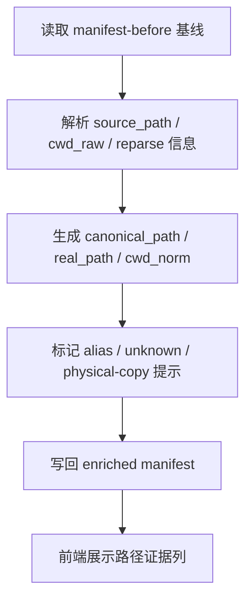

# path-and-project-canonicalization feature design

## 0. 术语约定

- **路径别名**：沿用 `CONTEXT.md`，指 Win32 / WSL / junction / symlink 等不同表示；防冲突结论：不等同于物理重复。
- **物理重复**：沿用 `CONTEXT.md`，指真实复制出的多份文件；防冲突结论：必须依赖 `real_path` 与文件事实判断。
- **Canonical Record**：本 feature 产出的归一化记录，扩展 roadmap 4.3 的 `Normalized Session Record`。

## 1. 决策与约束

### 1.1 需求摘要

要做的是：消费 item1 产出的 discovery / manifest 基线，把路径表示、项目目录和 reparse point 统一到可比较坐标系，并把“路径别名”与“真实副本”区分清楚，供后续去重和 UI 标注使用。

成功标准：

- 同一工程在 Win32 / WSL 表示下能收敛到同一 `cwd_norm`。
- 指向不同 `real_path` 的对象不会被误判成同一物理文件。
- 无法解析的 reparse point 会显式进入 warning / unknown，而不是静默合并。

明确不做：

- 不直接生成 delete plan。
- 不依据“最新修改时间”单独判定保留本。
- 不把浏览器旁路对象并入默认重复组。

### 1.2 复杂度档位

走 Windows 单机桌面工具默认档位，无偏离。

### 1.3 关键决策

- 归一化先产出稳定字段，再允许后续规划层消费；不把“判重逻辑”混进本 feature。
- `canonical_path` 负责“比较口径”，`real_path` 负责“物理事实”，两者必须并存。
- 无法安全解析的路径保守处理为 warning / unknown，不能假装归一化成功。

### 1.4 基线风险

- 当前仓库还没有任何路径样本夹具；实现时必须先补 junction / WSL / worktree 样本。
- item1 尚未落地前，本 feature 只有文档契约，没有现成 manifest 可用。

### 1.5 执行风险与证据计划

- Top 3 风险：
  - WSL/Win32 转换规则写错。缓解：fixture 覆盖双向路径示例。
  - junction / symlink 误判成物理重复。缓解：保留 `real_path` 与 `reparse_kind`。
  - 未知路径格式被静默吞掉。缓解：unknown/warning 必须可见。
- 非显然依赖：
  - item1 的 `manifest-before.json` schema 稳定。
  - 测试环境允许创建或模拟 reparse point 夹具。
- 证据类型：
  - 归一化前后 JSON artifact
  - fixture test 输出
  - 工作区路径标注截图
- 关键假设：
  - 归一化逻辑仍由 Go 后端提供，前端只渲染标注结果。
- 交付物清单：
  - 归一化服务
  - 路径样本夹具
  - 工作区路径证据列
- 清洁度规则：
  - 禁止硬编码单一用户名 / 盘符样本。
  - 禁止用“猜得到就合并”的宽松策略代替显式 warning。

## 2. 名词与编排

### 2.1 名词层

**现状**：

- 代码层暂无实现；现有约束只来自 roadmap 4.3 `Normalized Session Record`。
- item1 预期提供 discovery / manifest 基线，但当前仓库尚无真实输出。

**变化**：

- 新增 `PathEvidence`：保存原始路径表示、转换来源和失败原因。
- 新增 `CanonicalRecord`：在 `Normalized Session Record` 基础上补齐 `cwd_norm`、`real_path`、`reparse_kind` 和 UI 标注字段。
- 新增 `ProjectLabel`：为同工程的不同路径入口生成统一展示标签。

**接口示例**：

```go
record := CanonicalizePath(PathEvidence{
  RawPath: "/mnt/c/dev/project",
  Source: "rollout.cwd",
})
// 正常：cwd_norm = "c:\\dev\\project"
// 边界：若 reparse point 无法解析，reparse_kind = "unknown" 且 warning 可见
// 来源：roadmap 4.3 Normalized Session Record
```

### 2.2 编排层



**现状**：

- 当前没有任何路径归一化服务、样本夹具或前端路径标注列。

**变化**：

- 后端以批处理方式读取 manifest 基线，为每条记录生成稳定归一化字段。
- 前端工作区补充 alias / unknown / real path 标注，不自行推导路径语义。
- unknown 路径进入 warning/观察项，而不是继续流向“已判定安全”的状态。

**流程级约束**：

- 归一化必须幂等；同一输入重复运行输出一致。
- `canonical_path` 与 `real_path` 任一缺失时，不允许直接推导物理重复。
- fixture 需要覆盖 WSL、junction、worktree 和普通 Win32 路径。

### 2.3 挂载点清单

- `internal/canonicalization` 或等价服务入口：注册归一化批处理 — 新增
- `frontend/src/screens/scan-workspace` 的路径证据列 — 修改
- `fixtures/path-variants` 或等价样本目录 — 新增
- `manifest-before.json` 的 enrichment writer — 修改

### 2.4 推进策略

1. 编排骨架：建立归一化服务入口和 enriched manifest 占位  
   退出信号：能消费 manifest 基线并返回结构完整的空标注结果
2. 计算节点：实现 Win32 / WSL / reparse point 归一化  
   退出信号：fixture 能覆盖正常路径与关键边界
3. 证据节点：写入 `canonical_path` / `real_path` / `cwd_norm` / `reparse_kind`  
   退出信号：enriched manifest 字段稳定且可追踪来源
4. 前端接线：展示 alias / unknown / project label 标注  
   退出信号：工作区可肉眼区分路径别名与未知状态
5. 验证收尾：补齐 fixture 与构建命令  
   退出信号：Go 测试、前端构建和 smoke 入口可运行

### 2.5 结构健康度与微重构

##### 评估

- 文件级：暂无现有源码文件可改，预期只在 item1 建好的模块里新增路径归一化子包。
- 目录级 — `internal/canonicalization/`、`fixtures/`：目录要新建，不存在摊平问题。

##### 结论：不做

本 feature 只新增职责清晰的归一化子包和夹具目录，不需要前置微重构。

## 3. 验收契约

### 3.1 关键场景清单

- Win32 与 WSL 指向同一工程 → `cwd_norm` 一致，UI 标记为路径别名
- junction / symlink 指向同一物理对象 → `real_path` 一致，但不自动归类为物理重复
- 真实不同文件但内容相似 → `real_path` 不同，不被本 feature 合并
- 无法解析的路径或 reparse point → 进入 warning / unknown，可在工作区看到

### 3.2 明确不做的反向核对项

- 结果中不应直接出现 `duplicate_group` 最终分组判定。
- 代码中不应仅凭 `mtime` 选保留本。

### 3.3 Acceptance Coverage Matrix

| Scenario | Covered By Step | Evidence Type | Command / Action | Core? |
|---|---|---|---|---|
| Win32 / WSL 收敛到同一 `cwd_norm` | S2 / S3 | test, json artifact | 运行路径 fixture 测试 | yes |
| junction / symlink 不被误当物理重复 | S2 / S4 | test, screenshot | 运行夹具并查看工作区标注 | yes |
| unknown 路径显式可见 | S3 / S4 | screenshot, json artifact | 输入未知路径样本 | yes |
| 构建入口存在且可运行 | S5 | command output | 运行验证命令 | no |

### 3.4 DoD Contract

| ID | 要求 | 证据 | 阻塞级别 |
|---|---|---|---|
| DOD-DESIGN-001 | 归一化字段、边界和不做范围可执行 | design review | blocking |
| DOD-IMPL-001 | enriched manifest 与路径样本夹具落盘 | checklist / evidence | blocking |
| DOD-REVIEW-001 | code review passed 且无 unresolved blocking | review report | blocking |
| DOD-QA-001 | QA 覆盖 Win32/WSL、reparse、unknown 路径 | QA report | blocking |
| DOD-ACCEPT-001 | acceptance 确认 alias / unknown 与物理重复未混淆 | acceptance report | blocking |

Validation Commands:

| ID | 命令 | 目的 | 核心性 | 失败处理 |
|---|---|---|---|---|
| CMD-001 | `go test ./internal/...` | 验证归一化逻辑与样本夹具 | core | fix-or-block |
| CMD-002 | `npm --prefix frontend run build` | 验证路径证据列可构建 | supporting | fix-or-block |
| CMD-003 | `wails build -clean` | 验证桌面壳层集成未破坏打包 | supporting | fix-or-block |

Required Artifacts: enriched manifest、fixture 测试输出、路径证据截图、review / QA / acceptance 报告。

## 4. 与项目级架构文档的关系

- 系统级名词：`路径别名`、`物理重复` 已在 `CONTEXT.md` 中定义，本 feature 只需保持实现与定义一致。
- 若归一化规则最终沉淀为跨 feature 稳定约束，acceptance 时应评估是否补一条 ADR；design 阶段先不新增。
- 归一化输出直接受 roadmap 4.3 约束，不允许在实现时偷偷变更字段语义。
