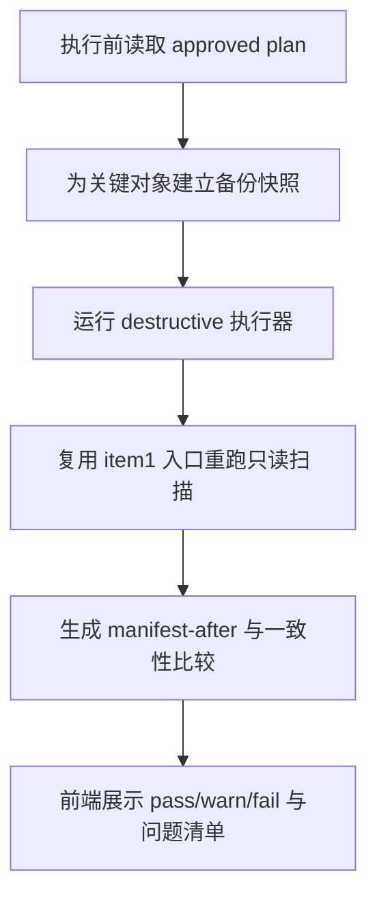

# post-run-verification-and-backup feature design

## 0. 术语约定

- **活动数据库**：沿用 `CONTEXT.md`，指当前客户端正在占用的 SQLite 状态对象；防冲突结论：不能当普通文件直接 raw copy。
- **回滚日志**：沿用 `CONTEXT.md`，记录 destructive 前后路径映射和结果；防冲突结论：不是备份本身。
- **Consistency Status**：本 feature 产出的执行后一致性结论，映射 roadmap 4.6 `consistency_status`。

## 1. 决策与约束

### 1.1 需求摘要

要做的是：在 destructive 动作前建立可恢复的备份快照，在执行后重跑只读扫描，生成 `manifest-after.json` 和一致性结论，把“做完了没有”从猜测变成证据链。

成功标准：

- destructive 前产出可定位的备份快照。
- destructive 后产出 `manifest-after.json` 和 `consistency_status`。
- 一致性不通过时，工作区显式显示 `warn` / `fail`，而不是继续显示“完成”。

明确不做：

- 不在本 feature 完成最终桌面 polish、帮助文档或打包收口。
- 不用伪造备份成功掩盖 SQLite / 权限失败。
- 不允许跳过复扫直接把执行视作完成。

### 1.2 复杂度档位

走 Windows 单机桌面工具默认档位，无偏离。

### 1.3 关键决策

- 备份与复扫是 destructive 流程的一部分，而不是可选附加步骤。
- 备份层与执行层分离：执行层只消费“备份已就绪”的事实，不自行兜底。
- 一致性校验优先基于 before/after manifest 与 artifact 对比，而不是肉眼判断。

### 1.4 基线风险

- item4 尚未落地前没有真实 rollback / exec result artifact。
- 如果没有稳定复扫入口，后续 acceptance 只能依赖“执行器说自己成功了”。

### 1.5 执行风险与证据计划

- Top 3 风险：
  - 活动 SQLite 备份方式不安全。缓解：用在线备份或显式阻断。
  - 复扫与执行前 schema 不一致。缓解：强制使用 item1 同源只读扫描入口。
  - 一致性失败被当作 warning 略过。缓解：状态进入 `warn/fail` 并阻断“完成”。
- 非显然依赖：
  - item1 的只读扫描入口稳定可重入。
  - item4 能提供 rollback / exec result 作为比对输入。
- 证据类型：
  - 备份快照路径
  - `manifest-after.json`
  - 一致性报告 / 工作区截图
- 关键假设：
  - 关键保护文件列表能从执行层共享出来，而不是在本 feature 重新定义。
- 交付物清单：
  - 备份协调器
  - 复扫协调器
  - before/after 比对器
  - 一致性报告面板
- 清洁度规则：
  - 禁止用空文件或同名 shim 伪造“备份已完成”。
  - 禁止把一致性失败降级成隐藏日志。

## 2. 名词与编排

### 2.1 名词层

**现状**：

- 当前代码层没有备份器、复扫器或一致性比较器。
- roadmap 4.6 的 rollback / verification artifact 是唯一硬约束。

**变化**：

- 新增 `BackupSnapshot`：记录备份对象、生成方式、时间戳和路径。
- 新增 `VerificationSummary`：承载 before/after 差异、warn/fail 原因和重跑建议。
- 新增 `ConsistencyIssue`：把需要用户进一步处理的问题结构化暴露出来。

**接口示例**：

```go
summary, err := VerifyRun(VerificationInput{
  BeforeManifest: "tmp\\runs\\...\\manifest-before.json",
  ExecResult: "tmp\\runs\\...\\exec-result.json",
  RollbackJournal: "tmp\\runs\\...\\rollback-journal.json",
})
// 正常：生成 manifest-after 与 consistency_status=pass
// 错误：备份失败或复扫失败显式报错，不伪造 pass
// 来源：roadmap 4.6 Rollback And Verification Artifacts
```

### 2.2 编排层



**现状**：

- 当前没有任何备份、复扫或一致性状态机。

**变化**：

- destructive 前先落备份快照，再允许进入 item4 执行器。
- destructive 后强制复扫，并使用 before/after artifact 产出一致性结论。
- 一致性结论回到桌面工作区，决定是否允许流程进入“完成”。

**流程级约束**：

- 关键对象备份失败即阻断 destructive 流程。
- 复扫必须复用 item1 的只读入口，不能新写一套“轻量扫描”。
- `consistency_status=warn|fail` 时，工作区不得展示“全部完成”。

### 2.3 挂载点清单

- `internal/backup` 或等价备份协调器 — 新增
- `internal/verification` 或等价复扫 / 比对器 — 新增
- 工作区一致性报告面板 — 新增
- 关键保护文件配置入口 — 修改

### 2.4 推进策略

1. 编排骨架：建立备份、复扫和一致性占位结果  
   退出信号：给定 fixture 输入时能返回结构完整的 verification 占位
2. 备份节点：实现关键对象在线备份 / 阻断规则  
   退出信号：保护对象能成功备份，失败时显式阻断
3. 复扫节点：复用 item1 入口生成 `manifest-after.json`  
   退出信号：执行后总能得到 after manifest 或显式错误
4. 比对节点：生成 `consistency_status` 和问题清单，并投影到工作区  
   退出信号：pass/warn/fail 三态都可见
5. 验证收尾：补齐 before/after 样本、测试和构建命令  
   退出信号：备份、复扫和一致性三类证据都能落盘

### 2.5 结构健康度与微重构

##### 评估

- 文件级：暂无现有源码文件可改，预期新增 backup / verification 子包和工作区报告面板。
- 目录级 — `internal/backup/`、`internal/verification/`、`frontend/src/screens/`：目录会新增或扩展，但职责边界清晰。

##### 结论：不做

本 feature 主要新增安全闭环模块，不需要前置微重构。

## 3. 验收契约

### 3.1 关键场景清单

- destructive 前关键对象备份成功 → 产生 `BackupSnapshot`
- destructive 后复扫成功 → 产生 `manifest-after.json`
- before/after 对比通过 → `consistency_status=pass`
- 缺失 artifact、复扫失败或关键差异 → `warn` / `fail`，工作区显式阻断完成态

### 3.2 明确不做的反向核对项

- 代码中不应跳过复扫直接将执行视为完成。
- 结果中不应出现“备份失败但仍标记 pass”的状态。

### 3.3 Acceptance Coverage Matrix

| Scenario | Covered By Step | Evidence Type | Command / Action | Core? |
|---|---|---|---|---|
| destructive 前成功建立备份 | S2 | json artifact, command output | 运行备份样本 | yes |
| destructive 后生成 manifest-after | S3 | json artifact | 运行执行后复扫 | yes |
| before/after 一致性 pass / warn / fail 三态可见 | S4 | screenshot, report | 导入不同样本并查看工作区 | yes |
| 备份失败阻断 destructive | S2 / S5 | test, screenshot | 模拟权限或占用失败 | yes |

### 3.4 DoD Contract

| ID | 要求 | 证据 | 阻塞级别 |
|---|---|---|---|
| DOD-DESIGN-001 | 备份、复扫和一致性三段式契约可执行 | design review | blocking |
| DOD-IMPL-001 | 备份快照、after manifest 和一致性报告落盘 | checklist / evidence | blocking |
| DOD-REVIEW-001 | code review passed 且无 unresolved blocking | review report | blocking |
| DOD-QA-001 | QA 覆盖 pass / warn / fail 和阻断路径 | QA report | blocking |
| DOD-ACCEPT-001 | acceptance 确认未跳过备份或复扫 | acceptance report | blocking |

Validation Commands:

| ID | 命令 | 目的 | 核心性 | 失败处理 |
|---|---|---|---|---|
| CMD-001 | `go test ./internal/...` | 验证备份、复扫与一致性比较器 | core | fix-or-block |
| CMD-002 | `npm --prefix frontend run build` | 验证一致性报告面板可构建 | supporting | fix-or-block |
| CMD-003 | `wails build -clean` | 验证桌面集成未破坏打包 | supporting | fix-or-block |

Required Artifacts: 备份快照索引、`manifest-after.json`、一致性报告、工作区截图、review / QA / acceptance 报告。

## 4. 与项目级架构文档的关系

- `活动数据库` 与 `回滚日志` 已在 `CONTEXT.md` 定义，本 feature 重点是把它们连接成安全闭环。
- 备份失败即阻断、复扫必须复用 item1 入口，这两条若在实现后稳定，应在 acceptance 时评估回写长期规则。
- `consistency_status` 的三态语义必须严格遵守 roadmap 4.6，不允许实现时自行缩减。
