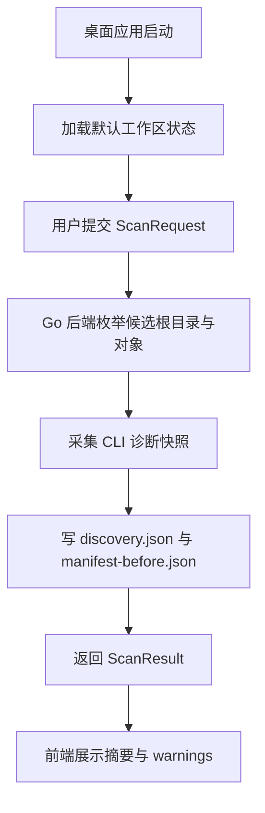

# read-only-manifest-baseline feature design

## 0. 术语约定

- **桌面壳层**：沿用 `.codestable/requirements/CONTEXT.md`，指 Wails2 宿主与前端工作区；防冲突结论：不把它写成“浏览器页面”。
- **执行任务**：沿用 `.codestable/requirements/CONTEXT.md`，指一次以 `run_id` 标识的只读扫描作业；防冲突结论：不把它退化成单个 CLI 命令。
- **Discovery Manifest**：本 feature 产出的 `discovery.json`，只含对象级元数据和 CLI 快照位置；防冲突结论：它不是删除计划。

## 1. 决策与约束

### 1.1 需求摘要

要做的是：把仓库从“只有文档、没有程序骨架”推进到“桌面应用可启动、能发起只读扫描、能写 discovery / manifest 基线并在界面展示摘要”。

成功标准：

- 桌面应用能启动并展示扫描工作区。
- 指向真实或夹具 `CODEX_HOME` 时，能生成 `discovery.json` 和 `manifest-before.json`。
- 缺失路径、CLI 不可用、浏览器旁路关闭等情况会显式告警，不会偷偷写 destructive 结果。

明确不做：

- 不生成 delete plan。
- 不执行 archive / quarantine / delete。
- 不默认扫描浏览器 / WebView2 用户数据正文。

### 1.2 复杂度档位

走 Windows 单机桌面工具默认档位，无偏离。

### 1.3 关键决策

- 第一个 feature 同时建立 Wails2 壳层和只读扫描闭环，而不是先做纯后端 CLI，再补桌面交互。
- 文件系统访问、CLI 调用和 artifact 写入全部在 Go 后端完成；前端只收 DTO 与事件。
- 本 feature 只写事实基线，不碰任何 destructive 动作，以降低真实样本未知性。

### 1.4 基线风险

- 仓库当前没有 Go module、Wails2 scaffold、前端脚本，也没有可运行 smoke 命令。
- git 仓库还没有 `HEAD`；本 feature 不直接阻塞，但后续 goal-state 会受影响。

### 1.5 执行风险与证据计划

- Top 3 风险：
  - Wails2 初始化模板与预设脚本不一致。缓解：第 1 步先固定 scaffold 和命令入口。
  - 真实 `CODEX_HOME` 布局与研究结论不完全一致。缓解：第 2 步保留 unknown items 与 warnings。
  - CLI 不可用时误让用户以为“扫描成功”。缓解：把 CLI 诊断结果和 warning 明确投影到 UI。
- 非显然依赖：
  - 本机存在 Go、Node、Wails2 CLI。
  - 真实样本或夹具路径可被应用读取。
- 证据类型：
  - `discovery.json`、`manifest-before.json`
  - 桌面工作区截图
  - `go test ./...`、`npm --prefix frontend run build`、`wails build -clean`
- 关键假设：
  - 前端工作区采用标准 `frontend/` 目录。
  - 输出工作区可落在项目内 `tmp/runs/<run_id>/` 或等价目录。
- 交付物清单：
  - Wails2 应用骨架
  - 只读扫描绑定入口
  - discovery / manifest artifact 写入
  - 桌面扫描工作区
- 清洁度规则：
  - 禁止遗留调试按钮、`TODO/FIXME`、注释掉代码、无用 import。
  - 若需诊断日志，只能走结构化 warning / job event，不准随手 `fmt.Println`。

## 2. 名词与编排

### 2.1 名词层

**现状**：

- 仓库还没有任何 Go 源码、Wails2 壳层或前端状态模型。
- 当前唯一硬约束来自 roadmap 第 4.1 / 4.2 节的 `ScanRequest` / `ScanResult` / `discovery.json` 契约。

**变化**：

- 新增 `AppBootstrap`：负责窗口初始化、绑定注册和默认工作区状态。
- 新增 `ScanRequest` / `ScanResult` DTO：作为前后端唯一请求/响应面。
- 新增 `DiscoveryItem` / `ScanSummary`：前者承载对象级元数据，后者承载 UI 摘要计数和 warning 数量。
- 新增 `WorkspaceState`：前端保存当前 `run_id`、最后一次 artifact 路径、warnings 和摘要。

**接口示例**：

```go
result, err := RunReadOnlyScan(ScanRequest{
  CodexHome: "C:\\Users\\Alice\\.codex",
  ExtraRoots: []string{"D:\\backup\\.codex"},
  IncludeBrowserSidecars: false,
  OutputDir: "E:\\github\\codex-history-clear\\tmp\\runs\\20260630-103000",
})
// 正常：返回 artifact 路径与 summary
// 错误：仅输入非法或工作区不可写时返回 error；CLI 不可用进入 Warnings
// 来源：roadmap 4.1 Desktop Scan Request / Result
```

### 2.2 编排层



**现状**：

- 还没有应用生命周期、扫描入口或 artifact 写入流程。
- 现阶段的主流程只存在于 roadmap 文档，没有任何代码事实可复用。

**变化**：

- 应用启动后先进入空工作区，不自动扫描。
- 用户触发扫描时，后端串行执行“候选根目录枚举 → CLI 诊断 → artifact 写入 → 返回摘要”。
- CLI 不可用、根目录缺失、浏览器旁路被关闭等情况，都以 warning 形式回到工作区。

**流程级约束**：

- 只读扫描不允许写 `OutputDir` 之外的路径。
- 同一输入重复扫描允许产生新的 `run_id`，但不能改变原始源文件。
- CLI 不可用属于可观察 warning，不属于“伪成功”或静默吞错。

### 2.3 挂载点清单

- `app.go` 或等价入口：注册 `RunReadOnlyScan` 绑定 — 新增
- `frontend/src/screens/scan-workspace` 或等价页面入口：承载扫描工作区 — 新增
- `internal/discovery` 或等价后端模块：写 `discovery.json` / `manifest-before.json` — 新增
- `wails.json` 或等价构建配置：定义 dev/build 入口 — 新增

### 2.4 推进策略

1. 编排骨架：初始化 Wails2 壳层、Go 绑定入口和空工作区  
   退出信号：桌面应用能启动，扫描按钮能触发 stub 结果
2. 发现节点：实现候选根目录枚举和 CLI 诊断快照采集  
   退出信号：给定夹具根目录时能返回对象清单与 CLI 诊断结果
3. Artifact 节点：写 `discovery.json` / `manifest-before.json` 并回填 `ScanResult`  
   退出信号：一次扫描后能在工作区看到有效文件路径
4. 前端接线：把摘要、warnings、artifact 路径渲染到桌面工作区  
   退出信号：工作区能区分成功摘要和 warning
5. 构建验证：固定 Go / frontend / Wails2 构建命令  
   退出信号：必跑命令全有真实入口，失败会显式暴露

### 2.5 结构健康度与微重构

##### 评估

- 文件级：无现有源码文件可改，全部为新建。
- 目录级 — `internal/`、`frontend/src/`：当前目录不存在，本次新建 discovery 与 workspace 两条主线，不存在摊平目录。

##### 结论：不做

当前阶段没有“只搬不改行为”的前置微重构对象；先把目录骨架建正即可。

## 3. 验收契约

### 3.1 关键场景清单

- 给定有效 `CODEX_HOME` → 工作区显示 run id、对象计数、artifact 路径，并存在 `discovery.json` 与 `manifest-before.json`
- 给定不存在的根目录 → 后端显式报错，前端不展示“扫描成功”
- CLI 不可用但根目录可读 → 扫描仍完成，只在工作区暴露 warning
- `IncludeBrowserSidecars=false` → 结果中只有跳过说明，不出现浏览器正文扫描产物

### 3.2 明确不做的反向核对项

- 代码中不应出现 delete / archive / quarantine 的执行入口。
- 只读扫描结果中不应写 `approved=true` 或 delete plan artifact。

### 3.3 Acceptance Coverage Matrix

| Scenario | Covered By Step | Evidence Type | Command / Action | Core? |
|---|---|---|---|---|
| 启动桌面应用并看到空工作区 | S1 | screenshot | 启动应用并观察工作区 | yes |
| 生成 `discovery.json` / `manifest-before.json` | S2 / S3 | command, json artifact | 运行只读扫描 | yes |
| CLI 不可用时暴露 warning | S2 / S4 | screenshot, json artifact | 模拟 CLI 缺失并扫描 | no |
| 根目录非法时报错 | S4 | screenshot | 输入非法路径 | no |
| 必跑命令存在真实入口 | S5 | command output | 运行构建命令 | yes |

### 3.4 DoD Contract

| ID | 要求 | 证据 | 阻塞级别 |
|---|---|---|---|
| DOD-DESIGN-001 | design 与只读边界完整可执行 | design review | blocking |
| DOD-IMPL-001 | Wails2 壳层、扫描绑定与 artifact 写入落盘 | checklist / evidence | blocking |
| DOD-REVIEW-001 | code review passed 且无 unresolved blocking | review report | blocking |
| DOD-QA-001 | QA 覆盖扫描成功、warning 与非法路径 | QA report | blocking |
| DOD-ACCEPT-001 | acceptance 确认只读边界未被突破 | acceptance report | blocking |

Validation Commands:

| ID | 命令 | 目的 | 核心性 | 失败处理 |
|---|---|---|---|---|
| CMD-001 | `go test ./...` | 验证 Go 绑定、发现层和 DTO 基线 | core | fix-or-block |
| CMD-002 | `npm --prefix frontend run build` | 验证前端工作区可构建 | core | fix-or-block |
| CMD-003 | `wails build -clean` | 验证桌面壳层可打包 | core | fix-or-block |

Required Artifacts: `discovery.json`、`manifest-before.json`、工作区截图、review / QA / acceptance 报告。

## 4. 与项目级架构文档的关系

- 系统级可见名词：`桌面壳层`、`执行任务` 已写入 `CONTEXT.md`，acceptance 只需核实实现与定义一致。
- 结构性决策：Go 后端 + Wails2 壳层已由 ADR 003 承载，本 feature 不再新增 ADR。
- 流程级约束：只读扫描、warning 语义和 artifact 边界若在实现后稳定，应在 acceptance 时确认是否回写到长期 guide。
