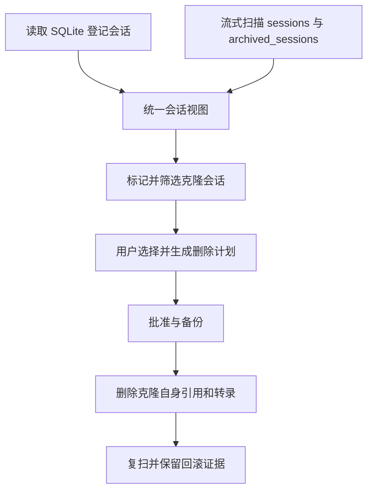

# clone-session-cleanup feature design

## 0. 术语约定

- **元数据克隆**：会话转录首条 `session_meta.payload` 中存在非空 `cloned_from` 的对象。它表示从另一会话复制而来，不等于当前内容仍与来源完全一致。
- **登记会话**：存在于 `state_5.sqlite.threads` 的会话。
- **文件型克隆**：存在于 `sessions` 或 `archived_sessions`，但未登记进 `threads` 的克隆会话。
- **相似会话**：首条消息、摘要、provider 等外观相似的会话。它是启发式重复诊断，不再使用“克隆”名称。

## 1. 决策与约束

### 1.1 需求摘要

目标：历史列表不能再把 SQLite 当唯一入口；它需要合并磁盘上的克隆会话，让用户能够筛出、选择、预览并通过现有备份和回滚流程删除这些文件。同时，时间筛选增加“14 天前”。

成功标准：

- 带 `cloned_from` 的有效会话转录即使未登记进 SQLite，也会出现在历史列表。
- 元数据克隆有明确标记，并能通过“仅元数据克隆”筛选后批量选择；无 `cloned_from` 的相似会话不得命中。
- 删除文件型克隆时，只处理该克隆 ID 和对应转录文件，不把 `cloned_from` 指向的来源会话当作删除目标。
- 同一克隆 ID 对应多个转录路径时，一个目标必须覆盖全部物理路径，不能任意挑一条。
- 时间筛选支持 14、30、90、180 天，语义均为会话最后活动时间早于对应天数。

明确不做：

- 不识别缺少 `cloned_from` 的旧版无标记克隆。
- 不因为存在 `cloned_from` 就自动建议删除；克隆可能在复制后继续产生新内容。
- 不改变最近 30 天保护和现有自动清理策略。
- 不删除来源会话，也不把来源会话与克隆强行合并为同一个 ID。

### 1.2 复杂度档位

走 Windows 单机桌面工具默认档位。方案不采用“只比较文件名”或“只读 SQLite”的简化路径，因为二者都无法证明对象是克隆；识别只信任结构化 `cloned_from` 元数据。

### 1.3 关键决策

- `history` 服务负责生成统一会话视图：SQLite 提供登记状态和标题，转录元数据补充克隆关系，未登记克隆由转录事实单独生成列表项。
- 克隆转录扫描范围限定为 `sessions` 和 `archived_sessions`，只接受 `rollout-*.jsonl`，避免把任意 JSONL 当删除候选。
- 文件型克隆只接受规范 UUID 会话 ID，防止磁盘输入把短字符串带入按 ID 清理的状态存储。
- 文件型克隆的最后活动时间来自逐行流式扫描得到的最大顶层时间戳；不能读取有效时间戳时保留条目、时间留空并返回可见扫描告警，不用文件修改时间冒充会话时间，也不让坏文件拖垮其余列表。
- 删除继续消费会话 ID 和已解析的转录路径，沿用计划、批准、备份、执行和复扫链路。
- 显式克隆标记接入更名后的“仅元数据克隆”筛选，但不进入自动建议删除集合；现有 provider/source/cwd 推测只保留为“相似会话”。
- 同一 ID 的所有有效转录路径进入 `rolloutPaths`；`rolloutPath` 仅作为界面代表路径，不是完整删除范围。
- 同一物理转录经正常路径和根内 junction 别名出现时按 Windows 最终句柄路径去重，不生成重复删除动作。
- 计划生成和执行前都校验：字面路径位于允许根目录、解析后的真实路径仍位于对应真实根目录、入口是普通文件、元数据 ID 与目标 ID 一致。symlink 文件直接阻断；junction 父目录只有在真实路径仍位于真实会话根时才允许。
- 列表公开返回 `ScanWarning{path, code, message}`；告警按 path/code 去重排序，摘要返回数量，前端顶部显示数量并提供详情入口。
- `sessions` 或 `archived_sessions` 不存在视为空集合；目录存在但无法读取或遍历才是致命错误。两者都不存在时返回空列表。
- `resolveTargets` 每次请求只构建一次会话目录，再按 ID 查找全部目标；计划阶段对目标 ID 集合批量查询 SQLite、单次扫描各 JSONL/JSON 状态文件，禁止逐目标重复开库或重扫文件。

### 1.4 基线风险

- 当前真实目录有数千个转录文件，扫描必须逐文件流式处理，避免把完整文件或完整目录一次性读入内存。
- 当前列表、计划和解析目标都只依赖 SQLite，三处必须共享同一套会话合并规则，不能各自猜测。
- 前端没有单测脚本，筛选行为主要靠 TypeScript 构建和浏览器验证。
- 当前刷新还会并行运行 discovery 全量扫描；克隆目录构建只能读取元数据和尾部时间戳，不重复计算内容哈希。

### 1.5 执行风险与证据计划

- 风险 1：删除克隆时误伤来源会话。缓解：计划目标始终使用克隆自身 ID；测试断言来源文件和来源数据库记录保留。
- 风险 2：扫描数千文件导致卡顿或高内存。缓解：逐行流式解析顶层时间戳，不计算哈希或保留完整文件内容；注入式测试证明每个根只遍历一次，并记录 3000 个最小转录夹具的参考耗时。
- 风险 3：列表能显示但删除解析仍只查 SQLite。缓解：列表和目标解析共用同一会话目录构建入口，集成测试走完整计划与执行。
- 风险 4：一次选择上千克隆导致计划阶段按目标重复扫描。缓解：计划计算以 ID 集合批量读取各存储，测试记录每个数据库和 JSONL 的打开或扫描次数。
- 非显然依赖：转录首行必须是有效 `session_meta`，`cloned_from` 必须是非空字符串；否则不认定为克隆。
- 关键假设：用户说的“14 天前”沿用当前时间筛选语义，即按最后活动时间，而不是克隆文件生成时间。
- 必跑验证：`go test ./...`、`npm --prefix frontend test -- --run`、`npm --prefix frontend run build`、`wails build -clean`、`git diff --check`、Wails 本地页面浏览器检查。
- 交付物：统一会话视图、克隆元数据字段、文件型克隆删除计划、14 天筛选选项、后端与前端验证证据。
- 清洁度：禁止临时调试输出、TODO/FIXME、吞错、注释掉代码和无用导入。

## 2. 名词与编排

### 2.1 名词层

**现状**：

- `ThreadSummary` 只表达 SQLite `threads` 行，没有“是否克隆、来源 ID、是否登记”字段。
- `ListThreads` 与 `resolveTarget` 均以 SQLite 为唯一会话集合。
- 前端“克隆项”是基于标题、摘要、provider 等信息推测，不读取克隆器的结构化元数据。

**变化**：

- 统一会话视图增加 `isClone`、`clonedFrom`、`originalProvider`、`registered`、`rolloutPaths`；`isClone` 只由非空 `cloned_from` 产生。
- `ListResult` 增加 `warnings: ScanWarning[]`，`ListSummary` 增加 `warningCount`。单文件告警 code 至少区分 invalid-json、invalid-session-meta、missing-timestamp；path/code 相同只返回一次。
- 登记会话按 ID 与转录元数据合并；文件型克隆生成只读列表项，`registered=false`。
- “仅元数据克隆”只使用 `isClone`；provider 差异只能参与“相似会话”判断。
- 后端内部 `SessionCatalogEntry` 是列表与目标解析的共同值对象，包含统一摘要、全部转录路径和扫描告警。

示例：

```json
{
  "id": "clone-id",
  "isClone": true,
  "clonedFrom": "source-id",
  "originalProvider": "openai",
  "registered": false,
  "rolloutPath": "C:\\Users\\me\\.codex\\sessions\\2026\\07\\01\\rollout-clone-id.jsonl",
  "rolloutPaths": [
    "C:\\Users\\me\\.codex\\sessions\\2026\\07\\01\\rollout-clone-id.jsonl",
    "C:\\Users\\me\\.codex\\archived_sessions\\rollout-clone-id.jsonl"
  ]
}
```

文件型条目字段规则：标题为“克隆会话 + 短 ID”，`source=clone-file`，provider/cwd/createdAt 来自 `session_meta`，updatedAt 来自最新顶层时间戳，archived 仅在全部路径均位于归档根时为 true，sizeBytes 为全部路径大小之和，无法从元数据证明的首条消息和摘要保持空值。

统一接口约束：`BuildSessionCatalog(paths)` 一次读取全部 SQLite 行并扫描两个会话根，返回按 ID 唯一的目录和结构化告警；`ListThreads` 在合并后统一执行 archived/CWD/grep 过滤、更新时间排序和 limit；`resolveTargets` 每次请求只构建一次目录并按 ID 前缀解析，不能循环调用会重复扫描的单目标入口。不存在的会话根是空集合；存在但不可读的根是致命错误；单文件无效返回可见告警。

批量计划接口约束：计划入口先收集全部目标 ID，再让每个 SQLite 数据库只打开一次、每个 JSONL/JSON 状态文件只扫描一次，得到按目标 ID 分组的命中结果；最后把共享计算结果投影回每个 `PlanTarget`，再附加各自的物理转录路径。批量接口对 1 个和 1000 个目标保持相同扫描次数级别。

### 2.2 编排层



**现状**：列表和删除目标解析都只查 SQLite；只读扫描虽然能看到文件，却没有进入主删除工作流。

**变化**：列表与目标解析共同消费统一会话视图。文件型克隆可以生成现有格式的删除目标，数据库和索引命中数允许为零，但 `rolloutPaths` 中每个转录都必须存在并进入备份与删除。来源 ID 只作为展示证据，不参与删除目标展开。

流程级约束：

- 只有结构化元数据明确声明 `cloned_from` 的转录才补入列表。
- 同一 ID 只出现一个逻辑列表项；SQLite 摘要字段优先，所有已验证转录路径完整保留。
- 用户选中的路径必须位于当前 `CODEX_HOME` 的会话目录内，且元数据 ID 与目标 ID 一致。
- 文件型克隆不存在或元数据已变化时，生成计划失败，不能静默跳过。
- 计划生成和真正执行前重复运行普通文件、字面路径、真实路径、元数据 ID 四项校验，防止批准后路径被替换。
- 删除仍受活动会话检查、批准、备份、回滚和执行后验证约束。

### 2.3 挂载点清单

- 后端统一会话视图与克隆转录解析入口。
- 历史列表和删除目标解析入口。
- 前端会话类型、元数据克隆判定与“仅元数据克隆”筛选。
- 前端扫描告警数量和详情入口。
- 时间筛选选项与阈值表。

### 2.4 推进策略

1. 会话事实层：解析并合并登记会话与文件型克隆。
   退出信号：未登记克隆出现在列表，普通未登记转录不出现。
2. 删除编排层：让文件型克隆进入计划、备份、执行和验证。
   退出信号：全部克隆路径可删除并回滚，来源会话保持不变，1000 个目标不会触发逐目标重扫。
3. 前端识别层：展示显式克隆信息，并把旧启发式“克隆”更名为“相似”。
   退出信号：仅元数据克隆只筛出登记和未登记元数据克隆，且不会自动选入建议删除。
4. 日期筛选层：增加 14 天选项并保持既有阈值行为。
   退出信号：14 天前能筛出边界外会话，14 天内不命中。
5. 验证收尾：运行后端、前端和浏览器验证。
   退出信号：自动化检查通过，扫描告警可查看，桌面宽度下无溢出或错误状态缺失。

### 2.5 结构健康度与微重构

评估：`history/list.go`、`history/plan.go` 和多个前端工作区文件已接近或超过项目 200 行，但新增职责可以落到独立的克隆扫描文件，避免继续加粗现有文件；`internal/history` 目录已有按职责拆分模式。前端只扩展现有类型和筛选，不新增平行页面。

结论：不做前置行为无关重构；克隆扫描与合并逻辑必须放入新文件，现有列表和解析函数只保留编排调用。

## 3. 验收契约

### 3.1 关键场景

- 未登记且带 `cloned_from` 的转录 → 列表出现，标记为克隆和未登记。
- 未登记但不带 `cloned_from` 的转录 → 不补入历史列表。
- 登记克隆 → 保留 SQLite 标题等字段，并补充克隆来源字段。
- 选择文件型克隆生成计划 → 计划包含全部转录路径的备份和删除，不要求 SQLite 必须命中。
- 同一 ID 同时存在 live 与 archived 转录 → 一个目标列出并删除两条物理路径，回滚后两条路径均恢复。
- 执行并回滚文件型克隆 → 克隆文件先消失后恢复，来源会话始终存在。
- 仅元数据克隆筛选 → 命中所有显式克隆，不因 provider 相同而漏掉；无 `cloned_from` 但 provider 不同的相似会话不命中。
- 14 天筛选 → 最后活动时间恰好达到阈值时命中，未达到时不命中。
- 元数据 ID 与路径目标不一致 → 明确失败，不生成可执行计划。
- symlink 文件或真实路径越出会话根 → 计划阶段明确阻断；批准后替换路径 → 执行阶段再次阻断。
- 坏 JSON 或无有效时间戳 → 其余列表正常返回，同时显示对应文件告警；无时间条目不命中任何“天前”筛选。
- 仅存在 `sessions`、仅存在 `archived_sessions`、两者都不存在 → 分别返回对应集合或空集合；存在但不可读时明确失败。
- 一次选择 1000 个文件型克隆 → 会话目录只构建一次，各 SQLite/JSONL/JSON 存储只打开或扫描一次级别，计划包含全部目标。

### 3.2 反向核对

- 不应把所有未登记转录都展示为克隆。
- 不应根据 `cloned_from` 自动选择删除或删除来源 ID。
- 不应把无 `cloned_from` 的 provider/source/cwd 差异会话标记为元数据克隆。
- 不应移除 30、90、180 天现有选项或改变最近 30 天保护。
- 不应在 `resolveTargets` 或计划构建中按目标数量重复扫描同一目录、数据库或状态文件。

### 3.3 Acceptance Coverage Matrix

| 场景 | 步骤 | 证据 |
|---|---|---|
| 登记与未登记克隆进入统一列表，普通未登记对象排除 | S1 | Go 单测、集成测试 |
| 坏文件产生可见告警且不阻断其他条目 | S1 | Go 单测 |
| 可选会话根缺失为空集合，存在但不可读为致命错误 | S1 | Go 单测 |
| 同 ID 多路径完整进入计划 | S2 | Go 集成测试、计划 artifact |
| 文件型克隆安全删除与回滚，来源对象保留 | S2 | Go 集成测试、执行 artifact |
| 1000 个目标只构建一次目录并批量扫描各存储 | S2 / S5 | 注入式扫描次数测试、集成测试 |
| ID 不一致、symlink、真实路径越界和批准后替换均阻断 | S2 | Windows/Go 安全测试 |
| 显式克隆筛选且不自动删除，启发式相似项不混入 | S3 | Vitest、浏览器检查 |
| 14 天恰好命中、差 1 毫秒不命中、无效时间不命中 | S4 | 可控时钟 Vitest |
| 3000 个最小转录只做单次根遍历、首尾读取且不计算哈希 | S5 | Go 结构测试、参考耗时记录 |
| Go、Wails 绑定与前端全链路无回归 | S5 | `go test ./...`、Vitest、frontend build、`wails build -clean` |

### 3.4 DoD Contract

| ID | 要求 | 证据 | 阻塞级别 |
|---|---|---|---|
| DOD-DESIGN | 统一目录、多路径和真实路径安全契约通过设计审查 | design review | blocking |
| DOD-IMPL | 文件型克隆可列出、计划、备份、删除、验证和回滚 | 集成测试 | blocking |
| DOD-REVIEW | 来源会话不受影响，无吞错或未批准 destructive 路径 | code review | blocking |
| DOD-QA | 元数据克隆筛选、告警展示、14 天边界、3000 文件和 1000 目标场景通过 | QA report | blocking |
| DOD-ACCEPT | Wails 工作区可筛选并删除文件型克隆，证据和回滚可见 | acceptance report | blocking |

## 4. 与项目级架构文档的关系

- 本方案修正了“SQLite 成为唯一真源”的偏差，重新符合 ADR-001 的只读扫描主控制面。
- 文件型克隆仍走批准、备份、回滚和复扫，符合 ADR-002；没有新增直接删除捷径。
- `cloned_from` 是克隆来源证据，不改变“逻辑重复”和“物理重复必须分开处理”的既有定义。
- Go 公共类型变化后必须重新生成并提交 Wails 绑定，不能只手改前端镜像类型。
